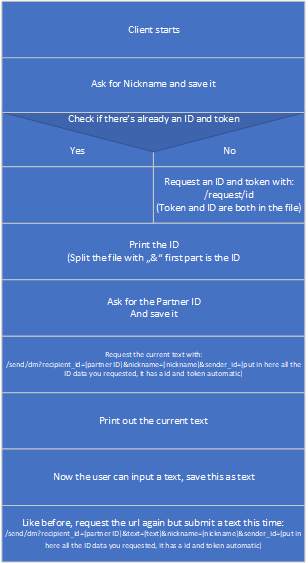
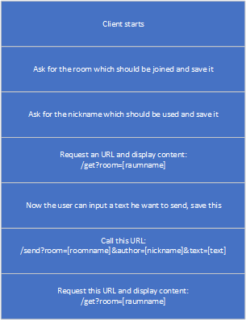

# Anon-Chat-Server

Easy to understand background api for an anonym chat. It can also be used for ingame chat.   
 I created comments, just read them (:   
You can find example clients [here](https://github.com/Braslerl/Anon-Chat-Clients).   
Feel free to create you own client and share it.   

# Clients ideas
You can see here how a client can use the api.

## How to create an client for direct messages

## How to create an client for room messages

